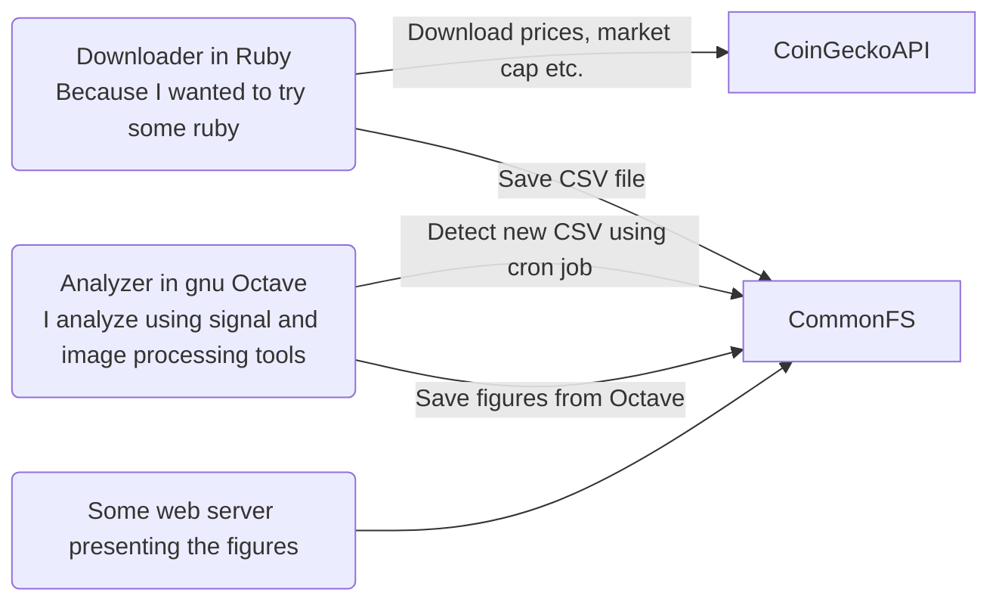
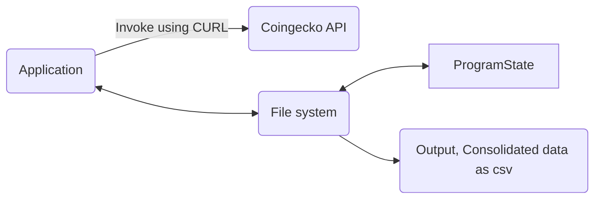
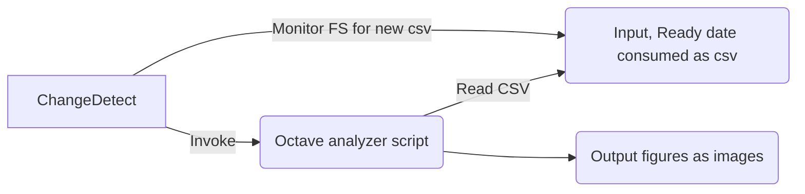
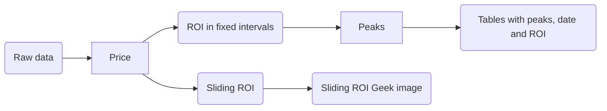

# System Architecture of this S.

All analysis is done in super experimental way, so the code should be possible to run and change from command line.

- The ruby code is possible to run via *IRB* (Ruby interactive)
- The octave code is run from Octave gui.
- All stuff is run from containers both to make it easy to deply, but also because I cannot install stuff.
- Initially all code was developed in a readme and copy pasted, later to be refactored
- Data was (and is) downloaded via Coingecko public API, this takes ages to download... I do respect the throtling

To consolidate data I write a small website - I hate javascript, so I will try not to use it, it does give some limitations on how i can cross reference data.

Anyway, the architecture will be something like this
No fcing enterprise architeture here, no database, no message broker, no sht, just files
## System Architecture

Initialize all code was in same folder, as i approach also having the web-server, I will move the source code for the 3 services into its own folder, I will not make repositories for each, because... why?

## Download and consolidate 1st level data 
All data is saved to a filesystem, the program is made to support shutdown and can continue from where it left of after reboot.

output table
|Filename|content|
|---|---|
|shared/birthdays.csv|Date of first valid data for CC|
|shared/cap.csv|Market cap for analyzed CC since the beginning|
|shared/price.csv|unit price for CC at given data|
|shared/vol.csv|Trade volume for CC at given data|

## Analysis and summary generation, 2nd level transformations
Something needs to monitor and trigger octave to run and output new files

### Analysis processing step

output table
|Processing step|Filename|content|
|---|---|---|
|ROI in fixed intervals|figures/fixed_roi/fr_WMQY_{idx}_{label}.png|Plot showing best opportunities for investing in specific CC given fixed interval (weekly, monthly, Quarterly, or yearly)|
|Price|figures/price_{r,w,m,y}_{idx}_{label}.png|Prices with different smoothing levels (raw, week, month, and year)
|Sliding ROI|figures/sliding_roi/srq_{idx}_{label}.png|Quantified image showing return of investment as function of date of investment and investment duration|
