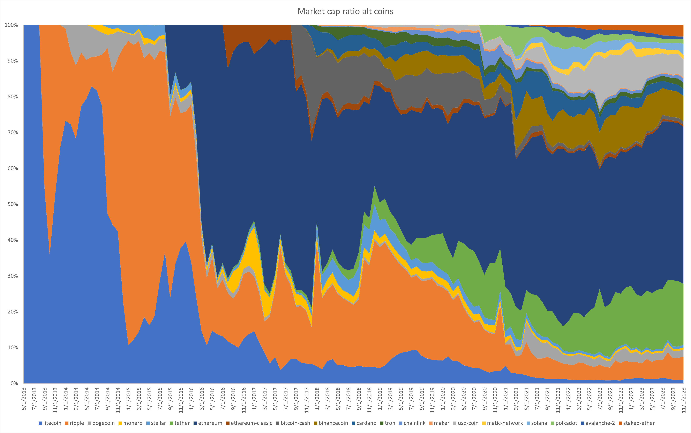
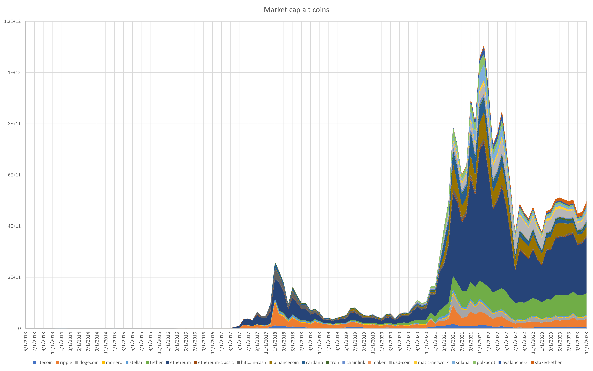

# Exploring market cap for different crypto currencies.
This project is for exploring crypto currency market cap as function of time, the main purpose is to identify which coins became influential and investigate why.

This readme was used for prototyping all the code, later functions was moved to [coin_functions.rb](coin_functions.rb)

## Result plots:




Data provided by CoinGecko using [CoinGecko public API ](https://www.coingecko.com/api/documentation) 

# Code for generating data.
All stuff is happening inside a container.
```docker
FROM ruby:latest
WORKDIR /root/gecko
CMD ["tail", "-f", "/dev/null"] 
```

Started with a persistance storage in my host OS
```docker
version: "3.2"
services:
  coinexplorer:
    container_name: coinexplorer
    build: './init/'
    volumes:
      - ./init/root:/root 
```

## Initialize folders...
Create folder for coins, and for historical data
```bash
mkdir coins
mkdir coins/history
mkdir coins/history/birthdays
mkdir assets
```

Fetching list of all coins from coingecko
```bash
curl -X 'GET' 'https://api.coingecko.com/api/v3/coins/list?include_platform=true' -H 'accept: application/json' >> coins.json
```

Load Coins
```ruby
require 'json'
coins = JSON.load File.new "coins.json"
ids = coins.map {|coin| coin["id"] }
```

Create coin info request
```ruby
ids.each { |x|

    # If we have valid data for the coin, then proceed
    if  coin_info_valid? x then
        puts "✔ : " + x

    # If we did not have the data, try to fetch it, with 5 retrys
    else
        cmd = coin_info_curl_command x
        i=1
        while (!coin_info_valid? x) and i < 6
            puts ("⚙"*i) +": " + x
            system cmd
            sleep 1 + i
            i=i+1
        end
    end
}

# Filter coins with no capital value and calculate total capital
market_cap = ids
    .map{ |id| 
        (coin_info_valid? id) ? [id, (load_coin_data id)["market_data"]["market_cap"]["usd"]] : [id, 0] }
    .filter{|x| 
        ( (!x[1].nil?) and (x[1] > 0)) }

market_cap_total = market_cap.inject(0.0) {|tot, x| tot+x[1]}
market_cap.sort_by! {|x| -x[1]}
```

# Proceed only considering top50 from today 22.Nov 2023
Also calculate percentage of market cap now
```ruby
market_cap_50 = market_cap[0..49].map {|x| {:id => x[0], :market_cap =>  x[1], :cap_ratio =>  x[1]/market_cap_total} }
```

# Get coin value for each day, given target resolution, using NN sampling
```ruby
require "date"
start_date = Date.new(2013, 05, 01) # first, first day of month on coin gecko with any valid data
end_date = Date.new(2023, 11, 01) # First day of this month (when creating script)
num_days = (end_date - start_date).to_i
width = 1900.0
step = num_days / width # Step in days, ruby works amazing adding numbers as days respecting remainders as fraction of days
 
```
# detect first entry of each coin
Find coin birthday, use binary search reducing number of dates to visit from worst case 'diff.to_i => 3836' to worst case 'Math.log2(diff.to_i)=>11.9' lookups pr coin
```ruby
market_cap_50.each { |x|
    find_coin_birthday(x[:id], start_date, end_date)
}
```

# Expand with birthday
If we did find all birthdays, 
expand the cap50 hashes with the birthday
```ruby
market_cap_50.map! { |x|
    x.merge( {:birthday => get_birthday(x[:id])} )
}
```

# Get coin data pr month for 15 oldes and 15 most valuable coins (21 merged)
```ruby
test_date = start_date
dates = [];
while test_date <= end_date
    dates.push(test_date)
    dates.push(test_date + 15)
    test_date = test_date.next_month
end

old_or_valuable_coins = (market_cap_50[0..14] | (market_cap_50.sort_by {|x| x[:birthday]}[0..14])).sort_by {|x| x[:birthday]}
dates.each {|test_date|
    # take old or coins with highest value
    old_or_valuable_coins.each {|x| 
        if (test_date >= x[:birthday]  ) then
            download_missing_coin_hist_with_retry(x[:id], test_date, 7)
        end
    }
}
```

# Create CSV file with market cap for each coin
```ruby
File.open("market_cap.csv", "w") do |file|
  file.puts(dates.inject("Dates ") {|string, date| string + ";" + date.strftime("%Y-%m-%d")})
  old_or_valuable_coins.each {|c|
    file.puts(dates.inject(c[:id]) {|string, date| string + ";" + safe_get_coin_market_cap(c[:id], date).to_s} )
  }
end
```

# Download thumbs
```ruby
old_or_valuable_coins.each { |c|
  img = load_coin_data(c[:id])["image"]["thumb"]
  system "curl " + img + " > assets/"+ c[:id] +"_thumb.png"
}
```
